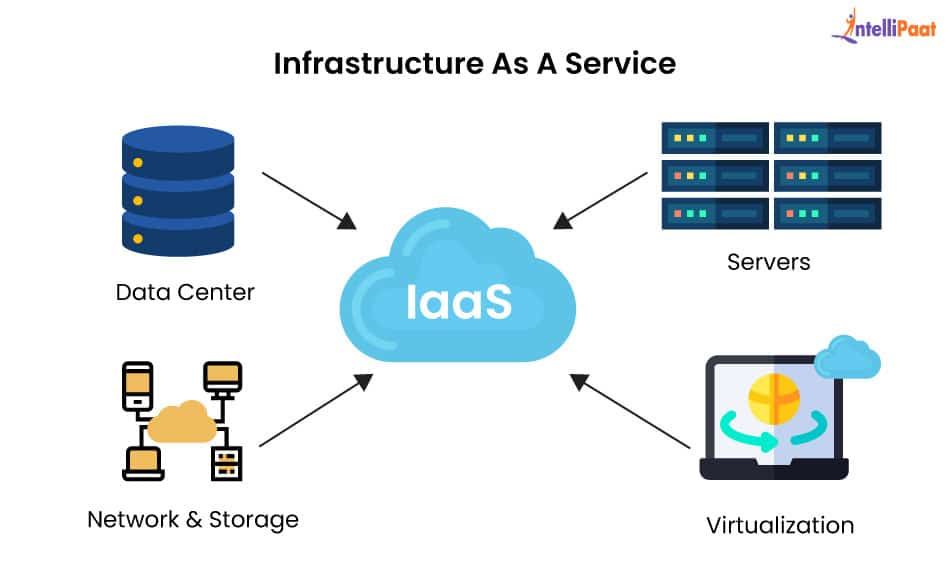

# Infrastructure as a Service (IaaS)

Infrastructure as a Service is a cloud-based service that allows us access to computing resources such as virtual servers, storage, and networking without owning any physical equipment. Instead of setting up and maintaining hardware, users can rely on a cloud provider to supply these components whenever needed.

We can connect with the machines we rented with the help of tools such as:

- SSH (Secure Shell) for Linux and Unix-based systems
- RDP (Remote Desktop Protocol) for Windows-based systems

In simple words, we can rent out fast and reliable machines located in a secure environment and use them remotely.

## Resources Offered by IaaS

Now that we have an idea of what IaaS actually is, let's explore all the resources IaaS offers.

1. Virtual Machines (VMs)
2. Networking
3. Load Balancers
4. Databases
5. Containers

## Benefits of Using IaaS

1. Flexibility  
   Configure and modify the combination of virtual machine sizes, storage options, and networking configurations.

2. Scalability  
   Increase or decrease the infrastructure resources according to the demand.

3. Cost Efficiency  
   Pay just for the resources you consume on a pay-as-you-go basis. Additionally, there are no upfront setup and maintenance costs.

4. Geographical Reach  
   IaaS provides server centres in different geographic regions, allowing us to deploy infrastructure resources nearer to end-users or target markets.

## References

1. [GeeksForGeeks - What is IaaS? Infrastructure as a Service Definition](https://www.geeksforgeeks.org/cloud-computing/infrastructure-as-a-service-iaas/)
2. [Microsoft Azure - What is infrastructure as a service (IaaS)?](https://azure.microsoft.com/en-us/resources/cloud-computing-dictionary/what-is-iaas)
3. [AWS - What is IaaS (Infrastructure as a Service)?](https://aws.amazon.com/what-is/iaas/)
4. [Image - From Intellipat](https://intellipaat.com/blog/wp-content/uploads/2024/12/9-1.jpg)
